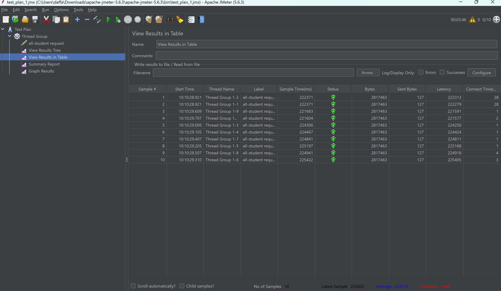

   
 JMeter Test Result from GUI MODE 

   ## Test Plan 1 in GUI

   
   
   
   

   ## Test Plan 2 in GUI

   
   
   
   

   ## Test Plan 3 in GUI

   
   
   
   
   

   
 JMeter Test Result from CLI Mode 

   
   
   
   

   
 Proof for Reaching 20% Performance Increase 

   ### First Endpoint

   before
   
   

   after
   
   

   ### Second Endpoint

   before
   
   

   after
   
   

   ### Third Endpoint

   before
   
   

   after
   
   
   

   
 JMeter Result after Optimizing + The Conclusion 

   
   
   

   ### Conclusion

After performing profiling and optimizing the application, I ran another performance test using JMeter. The results showed a significant improvement compared to the initial measurement:
   1. Elapsed Time: Decreased significantly, meaning requests are processed much faster.
   2. Latency: Also reduced, indicating that responses are being sent more quickly.
   3. These improvements suggest that the optimizations effectively removed bottlenecks and improved the overall efficiency of the application. 

By analyzing profiling data, I was able to identify slow operations and optimize them, leading to a much better performance outcome.
   

# Reflections

1. What is the difference between the approach of performance testing with JMeter and profiling with IntelliJ Profiler in the context of optimizing application performance?
 At first, I thought JMeter and profiling were basically the same thing, but after using them, I realized they focus on different aspects. 
JMeter simulates multiple users interacting with the system to test how well it handles traffic, 
while IntelliJ Profiler looks at what’s happening inside the application, analyzing CPU usage, memory allocation, and method execution times.
JMeter tells me that the system is slow, but profiling helps me figure out why. Both are important, JMeter gives a high-level view, and profiling helps pinpoint the actual bottleneck.

2. How does the profiling process help you in identifying and understanding the weak points in your application?
 Profiling helps identify weak points by showing which methods are slow, how CPU and memory are used, and where bottlenecks occur. 
IntelliJ Profiler provides real data on execution time, memory usage, and inefficient operations, making it easier to spot issues like slow database queries or memory leaks. 
It also helps measure improvements after optimizations.
   
3. Do you think IntelliJ Profiler is effective in assisting you to analyze and identify bottlenecks in your application code?
 Yes, IntelliJ Profiler is really helpful for analyzing and identifying bottlenecks in application code, but it has its limitations. 
It gives detailed insights into CPU usage, memory allocation, and method execution times, which makes it easier to spot inefficient loops, expensive method calls, or memory leaks. 
When I see a function taking too long or an object consuming too much memory, I can focus on optimizing that part of the code.
However, profiling only tells part of the story. It works well in a controlled environment, but it doesn’t always reflect how the application behaves under real-world traffic. 
For example, a method might seem efficient when running a single request, but under high load (like in JMeter tests), thread contention or database bottlenecks might cause performance issues that the profiler doesn't fully capture.
So while IntelliJ Profiler is great for code-level optimizations, I still need to combine it with other tools like JMeter, database monitoring, and logging to get the full picture.
   
4. What are the main challenges you face when conducting performance testing and profiling, and how do you overcome these challenges?
 One big challenge was figuring out what to focus on. The profiler gives a ton of data, and not all slow code is actually a problem. Sometimes, a method is slow because it’s doing exactly what it should.
JMeter was also tricky because simulating realistic traffic isn’t as easy as just sending a bunch of requests. If my test users behave differently from real users, the results won’t be meaningful.
Another issue was balancing performance with maintainability. Making things faster sometimes makes the code harder to read or maintain, so I had to be careful not to optimize just for the sake of optimization.
 To deal with this, I followed a step-by-step approach:
- Use JMeter to find slow endpoints.
- Use profiling to find inefficient code.
- Optimize the biggest bottlenecks without breaking functionality.

5. What are the main benefits you gain from using IntelliJ Profiler for profiling your application code?
 The biggest benefit was that it made invisible problems visible. Instead of guessing why something was slow, I could see exactly which methods were taking the most time.
It also helped with understanding memory usage. I didn’t realize how much object creation affects performance until I saw it in the profiler. 
By reducing unnecessary object creation, I could cut down on garbage collection, which improved performance.
Another great thing was thread analysis. I could see when multiple threads were waiting on the same resource, which helped me fix slowdowns in multi-threaded parts of the app.
    
6. How do you handle situations where the results from profiling with IntelliJ Profiler are not entirely consistent with findings from performance testing using JMeter?
 Sometimes, JMeter showed a slow response time, but the profiler didn’t highlight any major issues. 
I learned that’s because not all performance problems come from code, some come from database locks, network latency, or inefficient indexing.
 To handle this, I take a step-by-step approach:
- Check database logs
- Monitor system resources 
- Look at thread activity 
- Test under different condition
    
7. What strategies do you implement in optimizing application code after analyzing results from performance testing and profiling? How do you ensure the changes you make do not affect the application's functionality?
 The biggest lesson I learned was don’t optimize everything at once. Some slow code doesn’t actually impact real users, so I focused on the biggest bottlenecks first.
 The key strategies I used were:
- Fixing inefficient queries: Reducing redundant queries and adding indexes.
- Reducing object creation: Avoiding unnecessary new objects to cut down on garbage collection.
- Optimizing algorithms: Replacing slow loops with more efficient data structures.
- Using async processing: Moving non-essential work to background threads to keep responses fast.
  Most importantly, after every change, I reran tests to make sure I didn’t break anything. 

